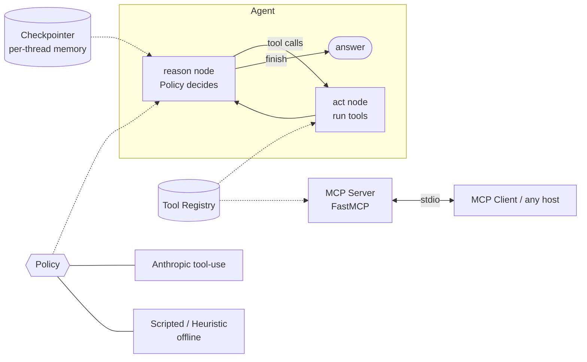

<div align="center">

# 🤖 agentic-workbench

**A tool-using ReAct agent — built twice (from scratch *and* in LangGraph), with a working MCP server.**

Shared tool layer · memory across turns · step-budget safety · a real Model Context Protocol
server + client. Fully testable offline with a scripted policy — no keys, no spend.

</div>

---

## Problem

Agents are the hardest part of production AI: the LLM is maybe 20% of the system, and the other 80%
— the loop, tools, memory, guardrails, observability — is where things break. This project builds
that 80% properly and twice: a **from-scratch ReAct loop** so the mechanics are visible, and a
**LangGraph** state machine with memory for the production shape. The same tools are exposed over
**MCP**, the emerging standard for how any model/host consumes tools.

## What it does

```bash
agent run "what is 12 * (3 + 4)?"        # LangGraph agent picks the calculator tool
agent run "explain mcp" --engine react   # same task via the from-scratch loop
agent mcp-demo                           # client spawns the MCP server and calls a tool over stdio
```
```
calculator('2 * (3 + 4)') -> 14.0
```

## Architecture



The **`Policy`** (the brain) is a swappable seam: `ScriptedPolicy` for deterministic tests,
`HeuristicPolicy` for offline demos, `AnthropicPolicy` for real Claude tool-use. The same
**`ToolRegistry`** feeds the agent *and* the MCP server, so there's one source of truth for tools.
Full reasoning in [`docs/architecture.md`](docs/architecture.md).

## Tech stack

`Python 3.12` · `LangGraph` · `MCP (FastMCP)` · `Anthropic` (tool-use) · `Pydantic v2` ·
`FastAPI` · `Typer` · `uv` · `ruff` · `mypy` · `pytest` · `Docker` · `GitHub Actions`

## Setup

```bash
git clone https://github.com/Arunops700/agentic-workbench.git
cd agentic-workbench
uv sync --extra dev
cp .env.example .env     # optional — runs offline with the heuristic policy if no key
```

Add `ANTHROPIC_API_KEY` (and keep `POLICY=anthropic`) for real Claude tool-use decisions; otherwise
the offline `HeuristicPolicy` drives the same loop so everything runs end to end.

## Usage

**CLI**
```bash
agent tools                              # list the tools
agent run "count the words in this"      # run the LangGraph agent
agent run "..." --engine react           # run the from-scratch ReAct loop
agent run "..." --thread chat-1          # name a thread → memory across runs
agent mcp-serve                          # start the MCP server (stdio)
agent mcp-demo                           # client: connect, list tools, call one
```

**API**
```bash
uv run uvicorn agentic_workbench.api:app --reload
# POST /run {"task": "..."}   GET /tools   GET /health
```

**Library**
```python
from agentic_workbench.config import load_settings
from agentic_workbench.factory import build_agent

agent = build_agent(load_settings())
print(agent.run("what is 2**10?").answer)
```

## How it works (the parts interviewers ask about)

1. **ReAct** — reason → act → observe → repeat. `react.py` is the framework-free version so the loop
   is legible; `graph.py` is the same idea as a LangGraph state machine.
2. **Tools** — name + description + JSON schema + a Python callable. The registry executes them
   **safely**: exceptions become error *results* the model can recover from, never crashes.
3. **Memory** — a LangGraph checkpointer persists state per `thread_id`; a resumed run sees prior
   history. This is also the hook for human-in-the-loop.
4. **Safety** — a **step budget** stops runaway loops (the #1 way agents burn money), plus a
   `calculator` that parses an AST instead of ever calling `eval()` on model output.
5. **MCP** — the tools are published on a `FastMCP` server; `mcp_client.py` shows any host
   discovering and calling them over stdio.

## Testing

```bash
uv run ruff check . && uv run mypy . && uv run pytest
```
18 tests, **fully offline** — the `ScriptedPolicy` makes the agent deterministic, so we test the
loop, memory, tools, MCP registration, and API with no keys, no network, no spend. That testability
*is* the design point. CI runs lint + type-check + tests on every push.

## Deployment

```bash
docker build -t agentic-workbench .
docker run -p 8000:8000 --env-file .env agentic-workbench
```

## Future improvements
- Multi-agent (supervisor + workers) via a LangGraph subgraph.
- Human-in-the-loop approval using LangGraph `interrupt` before destructive tools.
- Observability/tracing + guardrails (prompt-injection defense) — Milestone 4.
- Use the deployed RAG service (Milestone 2) as the `knowledge_search` tool.

## Learn more
- [`docs/architecture.md`](docs/architecture.md) · [`docs/interview-questions.md`](docs/interview-questions.md) · [`docs/lessons-learned.md`](docs/lessons-learned.md)

## License

[MIT](LICENSE) · Part of my [AI_Engineer](https://github.com/Arunops700/AI_Engineer) portfolio (Milestone 3).
